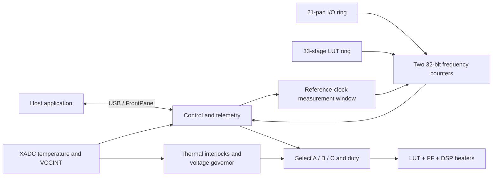

# Thermal-Induced Propagation Delay

FPGA instrumentation for measuring how propagation delay changes with die temperature. Built for the **Opal Kelly XEM7310-A75 (Artix-7)** as part of CS1410 computing-hardware lab development at Harvard SEAS.

**Author: Dandi Desta**

The experiment compares a ring oscillator routed through 3.3 V I/O buffers with a 33-stage LUT ring in the 1.0 V core. On-chip switching circuits heat the die, the XADC measures temperature and VCCINT, and hardware counters measure both oscillator frequencies over a shared reference-clock window. A companion host application converts frequency to normalized delay and fits its temperature dependence.

## Project highlights

- Two measurement channels: an I/O-path sensor and a core-LUT control, using identical frequency-counting logic.
- Three independently selectable fabric-heater regions with LUT/flip-flop activity and DSP multiply-accumulate activity.
- Hardware measurement windows, synchronized window control, and delayed capture of stable counters across clock domains.
- XADC polling with a DRP watchdog, conversion-liveness monitoring, and temperature telemetry.
- Duty-cycle control, gradual duty changes, supply-voltage limiting, and thermal interlocks.
- FrontPanel USB control and telemetry, with a version signature to detect incompatible host/FPGA combinations.

## Architecture



### Sensors and measurement

The top-level design instantiates `ring_io` with **21 IOBUF pad-loopback stages** and `ring_lut` with **32 inverters plus one inverting enable gate**. The I/O buffers drive and read back their own pads, so the ring needs no external loopback wires. The MC1/MC2 connectors must remain empty when using this design.

Each ring clocks its own 32-bit counter. The approximately 100.8 MHz FrontPanel `okClk` defines the measurement window; the window is synchronized into each ring domain. After the window ends, the controller waits approximately 5 microseconds before requesting capture. The design relies on the counters being stable by that point and on appropriate clock-domain constraints.

The RTL default window is 1,008,000 reference cycles, or 10 ms, when the window register is zero. The companion host normally requests 100 ms.

### Regional heating

The v2.00 source defines three regions, `RA`, `RB`, and `RC`, each with **9,000 LUT/flip-flop toggle cells and 40 DSP MACCs**. An MMCM supplies a nominal 403.2 MHz clock, and each region has a `BUFGCE` clock gate. Only one region is selected at a time, with A > B > C priority if multiple bits are requested.

An 8-bit PWM controls switching duty. The supply governor reduces the duty ceiling below approximately 0.970 V VCCINT and clears the ceiling and applied duty below approximately 0.938 V. Recovery is gradual. These are implemented thresholds, not a guarantee that every USB port or board will reach the same temperature.

The intended floorplan places A near the I/O sensor, B near the XADC, and C farther from both. Those physical placements require the original XDC pblocks, which are **not present in this checkout**.

### Temperature monitoring and interlocks

`xadc_mon.sv` alternates DRP reads of temperature and VCCINT. It counts completed reads and conversion events for diagnostics, retries a timed-out DRP transaction, and checks for recent conversion activity. Heater enable also requires MMCM lock and clear thermal alarms.

- Fabric temperature guard: trips near 85 C and clears below approximately 60 C.
- XADC over-temperature signal: an additional shutdown input.
- Companion host: defaults to a 78 C heating target and aborts above 82 C.

Conversion liveness tracks EOC activity; it is not an independent guarantee that every reported temperature is fresh. Board operation and safety behavior must be checked with the complete, correctly constrained hardware build.

## Measurement method and reported results

The analysis uses oscillator period as a relative delay proxy:

```text
frequency = counted cycles / measurement-window duration
delay proxy = 1 / frequency
normalized delay change (%) = 100 * (delay / reference_delay - 1)
```

For a fixed ring topology, this captures relative delay changes without claiming that the complete ring period is a single gate's absolute delay. The reference is the mean delay of the coolest `max(3, n // 20)` samples in the fit set. A positive slope means the ring slows as temperature rises. The fit reports slope in %/C, its estimated standard error, R-squared, and a rank-correlation statistic.

The experiment can record a cooldown after heating, soak at a staircase of duty levels, or monitor without heating. Repeating runs with A, B, and C helps examine how local heating and thermal gradients affect the relationship between the XADC reading and ring delay. Supply-voltage changes are recorded because they can also affect frequency.

Earlier project results reported in the author's resume:

| Measurement | Reported value |
| --- | --- |
| Samples | 208 |
| Temperature range | 42.8-78.4 C |
| I/O delay coefficient | 0.0481 %/C; R-squared = 0.98 |
| Core-LUT delay coefficient | 0.0176 %/C; R-squared = 0.91 |

These are historical reported measurements, not results regenerated from this checkout. Their raw dataset is not included here. The resume describes an approximately 48,000-flip-flop heater; the uploaded v2.00 source uses the three-region configuration above. The repository's earlier 64-ring/64-heater description also does not describe this source revision. Some source comments retain older pad counts; the instantiated top-level parameters determine the current configuration.

## Repository contents

| Path | Purpose |
| --- | --- |
| `thermolab.xpr` | Original Vivado 2022.2 project for `xc7a75tfgg484-1` |
| `thermolab.srcs/sources_1/new/thermolab_top.sv` | Top-level integration, clocks, windows, and USB endpoints |
| `thermolab.srcs/sources_1/new/ring_io.sv` | Parameterized I/O pad-loopback ring |
| `thermolab.srcs/sources_1/new/ring_lut.sv` | Parameterized core-LUT ring |
| `thermolab.srcs/sources_1/new/freq_counter.sv` | Ring-domain counting and host-domain capture |
| `thermolab.srcs/sources_1/new/heater.sv` | Three heater regions, PWM, duty ramp, and voltage governor |
| `thermolab.srcs/sources_1/new/xadc_mon.sv` | XADC DRP polling, diagnostics, and temperature guard |
| `thermolab.srcs/sources_1/ip/xadc_wiz_0/xadc_wiz_0.xci` | XADC Wizard IP configuration |

Generated Vivado caches, implementation products, checkpoints, and bitstreams are excluded. The Python acquisition/analysis application, `thermolab.py`, is maintained separately in a **private companion repository** and is not distributed in this public repository.

## Opening and rebuilding

This is an original-source archive with external build dependencies, rather than a self-contained one-command build.

1. Install Vivado with Artix-7 support. The supplied project was saved with **Vivado 2022.2**.
2. Obtain the appropriate Opal Kelly FrontPanel HDL support files for the XEM7310-A75 through the vendor's distribution.
3. Open `thermolab.xpr` and repair the external FrontPanel file references. The original project points to `../cs1410_lab/lab0/lab0_server/OK_library/`.
4. Restore the original **`thermolab.xdc`**, referenced as `../thermolab.xdc`, and update its project path. It is absent from the supplied folder. The correct board pin assignments, I/O standards, ring-loop exceptions, clock constraints, and heater/sensor placement constraints are required before implementation.
5. Regenerate the XADC IP output products from the included `.xci`. Its saved generation path uses the older `thermalab.gen` spelling; verify the output location in Vivado.
6. Use `thermolab_top` as the top module and `xc7a75tfgg484-1` as the target part. Disable automatic incremental synthesis or reset its missing checkpoint reference if Vivado requests the excluded generated `.dcp`.
7. Run synthesis and implementation, review DRC, timing, and clock-domain reports, then generate a bitstream. Do not infer a valid board configuration from successful synthesis alone.

Hardware acquisition additionally requires FrontPanel drivers, a compatible host environment, and a v2.00 bitstream whose signature is `0x544C0200`. Users with access to the private host repository can follow its setup, synthetic self-test, and acquisition instructions.

## FrontPanel interface

| Type | Address | Function |
| --- | --- | --- |
| WireIn | `0x00` | Bits 0/1: enable I/O/LUT rings; bit 2: enable heater; bit 3: pause heating during a window |
| WireIn | `0x01` | Bits 2:0: heater selection `{A,B,C}`; bits 15:8: duty request |
| WireIn | `0x02` | Window length in `okClk` cycles; zero selects the RTL default |
| TriggerIn | `0x40` | Bit 0: start a measurement |
| WireOut | `0x20`, `0x21` | I/O and LUT ring counts |
| WireOut | `0x22` | Temperature code, bits 11:0 |
| WireOut | `0x23` | Status and applied duty |
| WireOut | `0x24` | VCCINT code, bits 11:0 |
| WireOut | `0x25` | Design signature `0x544C0200` |
| WireOut | `0x26` | EOC count in bits 31:16; DRDY count in bits 15:0 |
| WireOut | `0x27` | Duty cap in bits 31:24; applied duty in bits 23:16; low-voltage flag in bit 3; heater selection in bits 2:0 |

Status bits 7:0 are `{sensor_ok, heat_alive, heater_any, mmcm_locked, ot, alarm_hot, done, busy}`. Bits 15:8 contain applied duty; bits 31:16 contain `0xA5C3`.

```text
temperature (C) = code * 503.975 / 4096 - 273.15
VCCINT (V)      = code * 3 / 4096
```

## Validation status

The original folder contains a September 8, 2026 implementation report with 30,797 slice LUTs, 34,151 slice registers, and 120 DSPs. Its reported worst setup slack is +0.208 ns and worst hold slack is +0.068 ns, with zero failing setup/hold endpoints among the analyzed paths. These are archived build observations, not a new build of this upload.

That same report lists critical clock-related warnings and unconstrained endpoints. Positive slack therefore does not establish complete timing coverage or hardware safety. A fresh implementation and board test remain necessary once the missing constraints and vendor dependencies are restored. No RTL testbench or measured dataset is included in this public snapshot.
